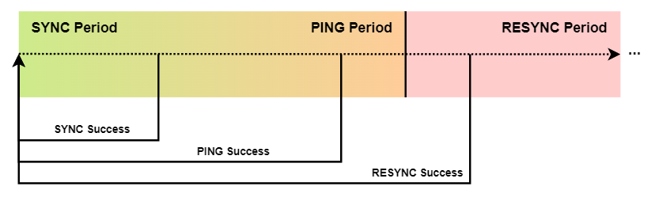

Distributed
***********

:code:`BoboCEP` is able to be distributed over multiple devices for
fault-tolerant CEP at the network edge.
Each software instance is able to synchronise with one-another in a
decentralised manner.

It accomplishes this by sharing any changes that occur to runs locally, and
updating local runs when remote instances notify it of its updates.
The type of message sent depends on the last successful communication that
an instance has had with an external instance.

   Distributed :code:`BoboCEP` sends different message types
   depending on the period of time since last communication
   with an external instance.

- :code:`SYNC` requests sync the most recent run changes: whether a run has
  completed, halted, or had its internal state updated with a new event.

- :code:`PING` requests simply ping the other instance if it has not sent a
  :code:`SYNC` request in a while, to make sure the other instance is
  still online.

- :code:`RESYNC` requests are sent when an instance has not been able to
  :code:`SYNC` or :code:`PING` another for a while, and ensures that the
  remote instance has the full system state. These requests may fail several
  times before being successful, depending on whether the external instance
  ever comes back online or not, or whether it recovers from its network
  failure, for example.

Additionally, a :code:`RESET` flag may be sent with messages to indicate
to other instances that they should fully :code:`RESYNC` with the instance
that sent the flag. This is useful when a hardware or software crash requires
an instance gets back up to speed; :code:`BoboCEP` does not store internal
state to disk.

.. note:: Distributed :code:`BoboCEP` is designed to be deployed at the edge
          of a single network, ideally with only 2-3 software instances.

Distributed :code:`BoboCEP` provides the additional benefit of
being able to **load-balance** data input into the system,
by simply delegating sensors to different :code:`BoboCEP` instances and
having them exchange their run changes accordingly.

Recovery Scenarios
==================

:code:`BoboCEP` is designed to handle errors and discrepancies with distributed
processing in the least complex way possible, that does not rely on excessive
message passing as part of its recovery strategy. Various scenarios, and their
expected recovery strategies, are discussed below.

The scenarios below consider three distributed instances -
:code:`A`, :code:`B`, and :code:`C` -
that are hosted on three separate devices.

Communication Failure
---------------------

Cannot send data to another instance.
^^^^^^^^^^^^^^^^^^^^^^^^^^^^^^^^^^^^^

If some instance :code:`A` is unable to communicate with :code:`B`, then it
will store all of the :code:`SYNC` data that it has been unable to send to
:code:`B` in a data **"stash"** and will periodically reattempt sending
the stash in the future.

If :code:`B` enters the :code:`PING` period, it will still attempt to
send :code:`SYNC` data if there is any in the stash or if a run is
completed, halted, or updated in Decider in the meantime.
If :code:`B` enters the :code:`RESYNC` period, its stash is wiped and it will
be forced to fully resynchronise with all runs in the Decider in :code:`A`.

.. note:: Decider is able to cache its :code:`n` most recently completed
          and halted runs. These cached runs are sent during a :code:`RESYNC`.

Run Complete
------------

Multiple instances complete same run with different events.
^^^^^^^^^^^^^^^^^^^^^^^^^^^^^^^^^^^^^^^^^^^^^^^^^^^^^^^^^^^

In this scenario, the complex events produced by the different instances
will have different histories: where the final event accepted by the
respective runs will vary.

For simplicity, :code:`BoboCEP` will not attempt to rectify the histories.
This is because:

- It is not possible to determine which history should be the one to keep; and
- Inconsistent events will still be mostly comparable, in the sense that
  the accepted events must have satisfied the same predicate.
  For example: if the predicate requires a temperature between
  :code:`0` and :code:`5` Celsius, then all events must have data
  within that acceptable range anyway.

Run Halt
--------

One instance completes run, another halts it.
^^^^^^^^^^^^^^^^^^^^^^^^^^^^^^^^^^^^^^^^^^^^^

For example:

- :code:`A` receives Run :code:`r` from :code:`B` which states that
  it is :code:`COMPLETE`; *however*
- :code:`A` *also* receives Run :code:`r` from :code:`C` which states that
  it is :code:`HALTED`.

In this scenario, :code:`COMPLETE` takes precedent over :code:`HALT`, and
:code:`A` will complete the run, producing a complex event accordingly.
It will do this if the run is in progress, or if it has previously been
halted by :code:`A`.

It will **not** produce multiple complex events for the same run if it
had already been completed by :code:`A` previously.

Run Update
----------

Update is multiple blocks ahead of local run.
^^^^^^^^^^^^^^^^^^^^^^^^^^^^^^^^^^^^^^^^^^^^^

For example, :code:`A` receives an :code:`UPDATE` for a run, where
the update is several blocks ahead of where its local copy of the run is.

In this scenario, the local run is simply pushed forward to the new block, and
the event history of the update replaces the local run history.

Update is behind local run.
^^^^^^^^^^^^^^^^^^^^^^^^^^^

In this scenario, the update is ignored.

One instance updates run, another halts it.
^^^^^^^^^^^^^^^^^^^^^^^^^^^^^^^^^^^^^^^^^^^

In this scenario, :code:`HALT` takes precedent over :code:`UPDATE`,
and the local version of the run is :code:`HALTED`.
