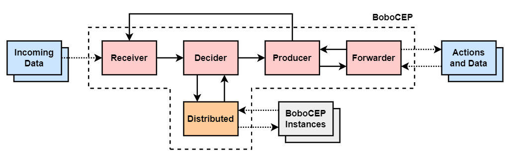

Getting Started
***************

Complex Event Processing
========================

The primary goal of :code:`BoboCEP` is to take streaming data that enters a
system in a serialised and uncorrelated manner (i.e., **simple events**),
and detect temporal **patterns** using it to infer the occurrence of some
higher-level **phenomenon**.
A **complex event** may be generated if a pattern of a phenomenon is fulfilled
with relevant data.
See `Phenomena <phenomena.html>`_ for more information.

On pattern fulfilment, an **action** may be taken in response which, in turn,
leads to the generation of an **action event** representing what happened
during action execution and whether it was successfully executed.
See `Actions <actions.html>`_ for more information.

Complex events and action events are added back into the system's data stream,
where they can be used for use in future pattern detection.
See the `Glossary <glossary.html>`_ for definitions of any unfamiliar
terminology.

Example
-------

An office may wish to detect the phenomenon of an office fire through various
data patterns that could infer its occurrence. Patterns may include:

#. A sharp rise in temperature sensor readings, followed by smoke detection
   within 1 minute of the rise in temperature.
#. Significant movement away from working spaces and towards the fire exit.
#. Or, it may simply be the pressing of the fire alarm, with no further
   correlations necessary.

When any of these patterns are fulfilled by the expected data, a number of
actions may be triggered as a response: fire alarms sound, sprinklers are
activated, and so on.

BoboCEP Architecture
====================

The architecture of :code:`BoboCEP` is based on the
*information flow processing* (IFP) architecture proposed by [CM2012]_.
This architecture is extended by enabling state updates to be synchronised
across multiple instances of :code:`BoboCEP` across a network for fault
tolerance.

   :code:`BoboCEP` architecture and external systems.
   Subsystems within dashed border are the core subsystems for a given
   :code:`BoboCEP` instance.
   Dotted arrows represent data exchange to and from external systems
   (blue, grey).

Engine
------

:code:`BoboCEP` is powered by a :code:`BoboEngine` instance, which maintains
data flow by sequentially executing its IFP subsystems in a round-robin
fashion, as follows:

#. The Receiver processes data entering the system, ensuring all data leaving
   the Receiver is a :code:`BoboEvent` instance.
#. The Decider checks each event against its patterns: instantiating, halting,
   advancing, and completing runs as necessary.
#. The Producer generates a :code:`BoboEventComplex` instance for a newly
   completed run, which is also sent to the Receiver.
#. The Forwarder executes the complex event's corresponding action and
   generates a :code:`BoboEventAction` instance once it has finished,
   which is also sent to the Receiver.

The subsystems are discussed in more detail below.

Receiver
^^^^^^^^

The Receiver is the entry point for data into the system.
Its purpose is to validate incoming data and then format it into a
**simple event**.
It also consumes **complex events** and **action events** and introduces
these event types into the data stream.

- Data of :code:`Any` type enters :code:`BoboReceiver` via the
  :code:`add_data` method.
- If the data is an instance of type :code:`BoboEvent`, then it is passed to
  :code:`BoboDecider` as-is.
- Otherwise, Receiver will wrap the data in a new :code:`BoboEventSimple`
  instance :code:`e`, where :code:`e.data` is the data passed via
  :code:`add_data`, and will send :code:`e` to Decider instead.
- A :code:`BoboValidator` instance is provided to the Receiver to ensure that
  all data must pass some validation criteria in order to be accepted by the
  system.
  For example, :code:`BoboValidatorJSONable` ensures all data are valid JSON.
  This validator is essential when using Distributed :code:`BoboCEP` to
  ensure all data in the system are serialisable.
  See `Distributed <distributed.html>`_ for more information.

Decider
^^^^^^^

The Decider manages **runs**, which represent instances of **patterns** that
require data to fulfil its **predicates**.
Once its predicates have been satisfied by a sequence of applicable events,
the run is completed.

- A :code:`BoboPhenomenon` contains one or more :code:`BoboPattern` instances
  and a :code:`BoboAction` instance.
- A :code:`BoboRun` is created when the first predicate of a
  :code:`BoboPattern` is satisfied with some :code:`BoboEvent`.
- Once a run has had its final predicate satisfied, Producer is notified.

Producer
^^^^^^^^

The Producer generates a **complex event** when it receives notification from
the Decider that a run has completed.
The complex event is considered as a representation of a phenomenon that has
been observed, as per the fulfilment of its pattern via the completed run.

- When a Run has completed, :code:`BoboProducer` will produce a
  :code:`BoboEventComplex` instance, indicating the observation of the
  phenomenon that the pattern is evidence of.

- The Producer passes the complex event to Forwarder, in order to trigger the
  phenomenon's corresponding :code:`BoboActon`.
  It also passes the complex event to Receiver, which adds it to the data
  stream.

Forwarder
^^^^^^^^^

The Forwarder triggers actions passed to it by Producer and executes them.
This may involve communication with external services.
Each action leads to the generation of an **action event** that details what
occurred during action execution.

- :code:`BoboForwarder` checks the complex event against its phenomenon to
  determine which action it needs to execute, if any.

- It executes the action and produces a corresponding :code:`BoboEventAction`
  that contains reference to the complex event which led to its execution.

- The :code:`BoboEventAction` is passed to the Receiver and added to the data
  stream.

Distributed
-----------

:code:`BoboCEP` is able to be executed across multiple software instances
and remain synchronised, such that each instance maintains an identical copy
of system state through active replication.
See `Distributed <distributed.html>`_ for more information.

Quick Start
===========

The key components to getting started with :code:`BoboCEP` are as follows.

#. Define the `Phenomena <phenomena.html>`_ that you would like to model by
   defining one or more patterns per phenomenon. Use :code:`BoboPatternBuilder`
   for defining patterns to make things much easier.

#. Define `Actions <actions.html>`_ that should be executed if a phenomenon
   were to be triggered. Allocate an action to a phenomenon if you wish, or
   leave it blank.

#. Decide whether you want BoboCEP to be `Distributed <distributed.html>`_ or
   not, and use one of the setup classes to help with setting up the system
   engine and all of its components: :code:`BoboSetupSimple` and
   :code:`BoboSetupSimpleDistributed` are provided for these purposes.

Check out the `Examples <examples.html>`_ page for various ways to
set up :code:`BoboCEP` and connect it to external systems (e.g., Flask).

To explore the API in more detail, see `Source Code <source_code.html>`_.

Why "Bobo"?
===========

Bobo is the name of Mr Burns' childhood teddy bear that features in the episode
"`Rosebud  <https://en.wikipedia.org/wiki/Rosebud_(The_Simpsons)>`_"
of The Simpsons.

References
==========

.. [CM2012]
    Cugola, G., & Margara, A. (2012).
    `Processing flows of information: From data stream to complex event processing
    <https://doi.org/10.1145/2187671.2187677>`_.
    *ACM Computing Surveys (CSUR)*, *44*\(3), 15.
