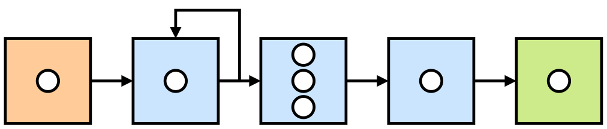
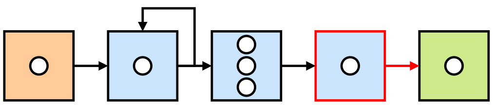

Phenomena
*********

A data stream contains uncorrelated, simple events, e.g. sensor data on a
room's temperature at a given point in time.

However, there may exist correlations among sensor data to indicate
higher-level **phenomena** occurring in the physical space that simple data
events alone cannot identify.
Identifying such phenomena would give rise to higher-level **complex events**
which, in turn, can be used to detect further complex phenomena, and so on.

Therefore, a phenomenon represents some (real-world) circumstance that one
may wish to model in the system by observing **patterns** in streaming data
that, when fulfilled with applicable data events, infer the existence or
occurrence of the phenomenon at that point in time.

In :code:`BoboCEP`, a phenomenon has one or more patterns whereby, if any of
the patterns were fulfilled with appropriate data, then a complex event is
generated to represent that the phenomenon was identified at that given
point in time, with correlated data events as evidence for this observation.

Patterns
========

Patterns are modelled as a series of blocks, with each block containing one
or more predicates.

   A series of blocks for a pattern.
   White circles represent predicates.
   Starting block is orange, intermediary blocks are blue,
   and final block is green.

Fulfilling a pattern starts with an event that satisfies the predicate of
the first block of the pattern.
From there, a **run** is generated to track the progress
across the blocks of the pattern (see :ref:`phenomena:Runs`).

Checking an event against a predicate is as follows.

.. code:: python

   def evaluate(self, event: BoboEvent, history: BoboHistory) -> bool:
       ...

During evaluation, the :code:`event` being checked is passed, as well as the
:code:`history` of all events that were previously accepted by the previous
blocks in the series.
If any predicate in a block evaluates to :code:`True`, the event is
accepted and added to the history, and the block moves to the next block in
the series.

Each block can have a group name associated with it, which will be used in
the :code:`history` to group accepted events. Multiple blocks can share
the same group name.

Blocks can have the following additional properties.

Negated
-------

Negated blocks can check whether an event does *not* pass its predicate
i.e. predicate success is based on whether it returns :code:`False`
instead of :code:`True`.
First and final blocks cannot be negated.
A negated block cannot also be optional (see next).

Optional
--------

Optional blocks may be satisfied by an event but, if not, then the
event is also checked against the subsequent block. If that block is also
optional, it continues on until either an optional block is satisfied by the
event, or a non-optional block is reached.
First and final blocks cannot be optional.
As stated, an optional block cannot also be negated.

Looping
-------

Looping blocks enable both the current block and next block to be
potential paths through a pattern's block series.
First and final blocks cannot loop.
A looping block can neither be negated nor optional.

Contiguity
----------

If an event is checked against a block and is **not** accepted, then
contiguity determines what should happen next.

- **Strict** contiguity means that the pattern should **halt** (i.e. stop) and
  all progress towards the final block is lost.
  A strict block cannot also be optional.

- **Relaxed** contiguity means that the pattern can tolerate events entering
  the system which it does not require for its pattern.

Conditions
----------

In addition to blocks, there are also **preconditions** and **haltconditions**.
These are additional predicates against which an event is evaluated *before*
passing the event onto the current block's predicate(s).

- **Preconditions** are predicates whereby, if an event does not successfully
  match against *all* predicates, then the pattern will halt. If it does match
  against them all, then the event will be passed to the current block of
  the pattern.
  For example, a precondition may be that all data originates from the same
  sensor device.

- **Haltconditions** are predicates whereby, if an event successfully matches
  against *any* predicate, then the pattern will halt. If it does not match
  any haltcondition, then the event will be passed to the current block of
  the pattern.
  For example, a haltcondition may be to halt if 60 seconds has passed since
  the first event in the history i.e. the pattern must reach completion
  within 60 seconds.

Runs
====

Runs serve as instances of patterns.
Each pattern can have multiple runs at any given time, for example,
if the first predicate of the pattern is satisfied multiple times.

   Run :code:`r` serves as an instance of pattern :code:`p` and
   keeps track of its state across the pattern's blocks.

Runs work as follows:

#. When the first predicate of a pattern has been satisfied by an event,
   a run is **generated**.

#. The run continues to monitor the state of the partially-completed pattern
   as more and more events 'push' the currently-monitored block towards
   the pattern's final block.

#. Once the final block's predicate has been satisfied, the Producer
   is notified of the completed run, leading to the Producer generating
   a **complex event** which is sent to the Receiver.

#. The Forwarder, in turn, executes the associated phenomenon's Action (if one
   exists). Once it has finished execution, whether successful or not,
   an **action event** is produced and sent to the Receiver.

If a run needs to end before reaching the final state (e.g. because of a
contiguity requirement or satisfied haltcondition), then it enters a
**halted** state and is removed from the list of active runs.
