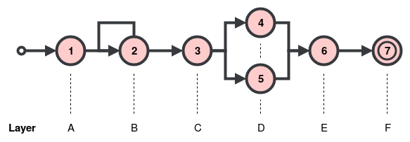

Patterns
********

Introduction
============

Defining a complex event requires a pattern that, when fulfilled with relevant events from the input stream,
will trigger the generation of a complex event.
The :code:`BoboPattern` API is provided to define patterns.

When we define a pattern, we are defining **layers** of an automaton, where each layer has one or more states.
This is demonstrated in the figure below.

   The relationship between automaton states and their labels.

State 2 is a *looping* state, making it *nondeterministic* because it can transition to either state 3 or back to
state 2 again.
Every event that causes a loop back to state 2 will be associated with label B.
State 3 can transition to both state 4 and state 5, making it nondeterministic also.
Events for both state 4 and state 5 will be associated with label D.

We define a new :code:`BoboPattern` instance as follows.

.. code:: python

    from bobocep.rules.nfas.patterns.bobo_pattern import BoboPattern

    pattern = BoboPattern()

Transitions
===========

Building a pattern requires building a sequence of **transitions** between layers of states.
To cause a state transition, an event is required to fulfil the criteria of the state's **predicate**.
The predicate is a function that takes two arguments:

- The event that is attempting to fulfil the criteria.
- A :code:`BoboHistory` instance that contains all of the previous events that have currently been accepted by the
  run of the automaton.
- A list of recently accepted complex events, represented as :code:`CompositeEvent` instances.

In Python, we can define a predicate function in two ways.
A regular `function <https://docs.python.org/3/tutorial/controlflow.html?#defining-functions>`_.

.. code:: python

    from typing import List
    from bobocep.rules.events.bobo_event import BoboEvent
    from bobocep.rules.events.histories.bobo_history import BoboHistory
    from bobocep.rules.events.composite_event import CompositeEvent

    def my_function(event: BoboEvent, history: BoboHistory, recents: List[CompositeEvent]) -> bool:
        # return [...]

    predicate = my_function

Or, a `lambda <https://docs.python.org/3/tutorial/controlflow.html?#lambda-expressions>`_ expression
i.e. an *anonymous function*.

.. code:: python

    predicate = lambda e, h, r: # [...]

Where :code:`e` is the :code:`BoboEvent` instance, :code:`h` is the :code:`BoboHistory` instance, and :code:`r` is the
list of recently accepted complex events.
When the predicate is defined, it needs to be placed into a :code:`BoboPredicateCallable` instance, as follows.

.. code:: python

    from bobocep.rules.predicates.bobo_predicate_callable import BoboPredicateCallable

    pred_func = BoboPredicateCallable(predicate)

If the predicate returns :code:`True`, the state associated with the predicate becomes the next state of the run.
If :code:`False`, the run will take some other action, depending on the **contiguity** policy associated with the
transition, discussed next.

Contiguity
----------

The policy of states with regard to how they react to events that do not cause a state transition.
:code:`bobocep` supports three types.

Strict
++++++

All matching events are *strictly* one after the other, without any non-matching events in-between.
If an event does not match, the run halts.
The :code:`next` interface is used for strict contiguity.

.. code:: python

    pattern.next(
        label="label_strict",
        predicate=pred_func)

Relaxed
+++++++

All non-matching events are ignored.
The run simply waits for a matching event.
The :code:`followed_by` interface is used for relaxed contiguity.

.. code:: python

    pattern.followed_by(
        label="label_relaxed",
        predicate=pred_func)

Non-Deterministic Relaxed
+++++++++++++++++++++++++

The same as relaxed contiguity, but allows multiple matches from a state when its transition is non-deterministic.
The :code:`followed_by_any` interface is used for non-deterministic relaxed contiguity.

.. code:: python

    pattern.followed_by_any(
        label="label_nondet",
        predicates=[
            pred_func_1,
            pred_func_2,
            pred_func_n
        ])

Conditions
==========

Before an event is passed to any state in a run, it is first passed to a set of **preconditions**, followed by a set of
**haltconditions**.

Preconditions
-------------

Preconditions are predicates where, if *any* of them evaluate to :code:`False`, the run is halted.
One of the most important preconditions is a *time window*, where runs require completion within some given
time limit.
This is important for *state clearance* i.e. ensuring runs are always eventually halted and removed from memory,
to prevent an endless build-up of incomplete runs with no means of halting.

For example, if we want to ensure that all events occur within 1 minute of each other, we can use the
:code:`BoboPredicateWindowSlidingFirst` class to specify the time interval, in seconds, that can exist between
the first event accepted by a run and the current event being checked.

.. code:: python

    from bobocep.rules.predicates.windows.sliding.window_sliding_first import WindowSlidingFirst

    pattern.precondition(WindowSlidingFirst(interval_sec=60))

Each successive call of :code:`precondition` will add another predicate to the list.

Haltconditions
--------------

Haltconditions are predicates where, if *any* of them evaluate to :code:`True`, the run is halted.
This is useful if you want a run to halt if something happens within the lifetime of the run.

For example, we can halt a run if a :code:`CompositeEvent` with name :code:`'B'` has just been
generated.

.. code:: python

    pattern.haltcondition(
        BoboPredicateCallable(lambda e, h, r: isinstance(e, CompositeEvent) and e.name == 'B')

Each successive call of :code:`haltcondition` will add another predicate to the list.

Chaining Patterns
=================

Multiple :code:`BoboPattern` instances can be chained together.

.. code:: python

    pattern_a.append([
        pattern_b,
        pattern_c
    ])

In the example above, :code:`pattern_a` contains the transitions, preconditions, and haltconditions of :code:`pattern_b`
*directly after* those already in :code:`pattern_a`, and :code:`pattern_c` information directly after that.
